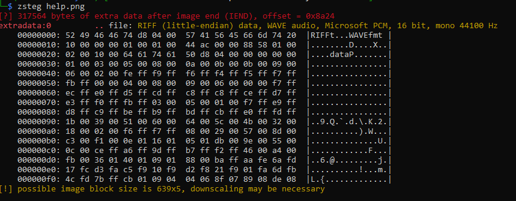
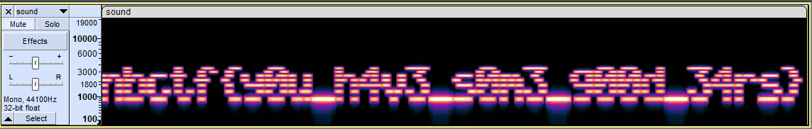

# do you hear that?
> I'm not sure why, but when I look at this image I can hear some sort of faint sound. Do you hear it too?
## Solution

Challenge description is giving the hint that there is an audio file inside the image. I tried ```steghide``` and ```binwalk``` but there is no results. Finally, ```zsteg``` can detect a .wav file inside help.png.

```
zsteg -e extradata:0 help.png > sound.wav
```
<p align="center">
  
</p>
You can use spectogram analysis application such as Audacity to see the message.
<br><br>

<p align="center">
  
</p>

## Flag 
The flag for this challenge is ```nbctf{y0u_h4v3_s0m3_g00d_34rs}```
